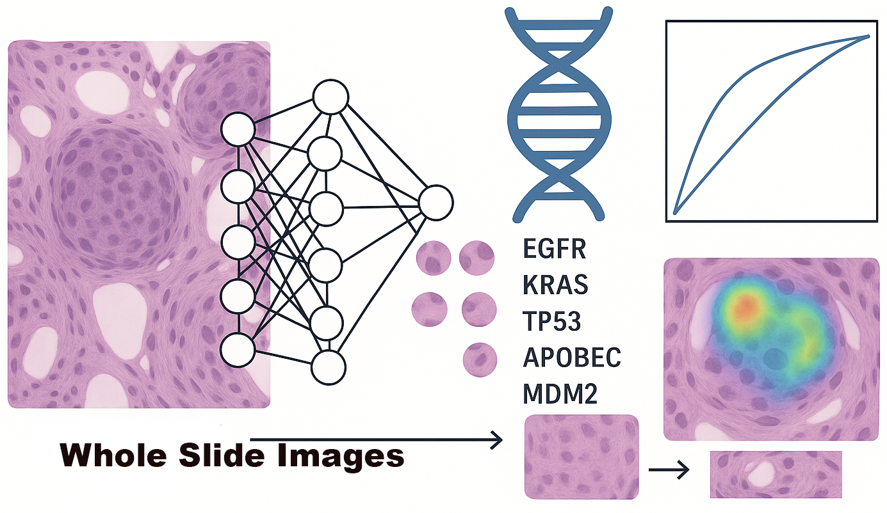

# Deep Learning for Molecular and Genomic Characterization of Lung Cancer in Never-Smokers Using Hematoxylin and Eosin-Stained Images

Mutation_AI is a deep learning project for mutation analysis using Convolutional Neural Networks (CNNs) with two main modules:
- `Multilabel_CNN`: For multi-label classification tasks.
- `Binary_CNN`: For binary classification tasks.

Both modules implement a custom ResNet-50-like architecture using TensorFlow/Keras.

---



---

## Table of Contents

- [Installation](#installation)
- [Project Structure](#project-structure)
- [Usage](#usage)
  - [Multilabel CNN](#multilabel-cnn)
  - [Binary CNN](#binary-cnn)
- [Data Structure](#data-structure)
- [Model Architecture](#model-architecture)
- [Requirements](#requirements)
- [Contributing](#contributing)
- [License](#license)

---

## Installation

1. **Clone the repository**

   ```bash
   git clone https://github.com/monjoybme/Mutation_AI.git
   cd Mutation_AI
   ```

2. **Install dependencies**

   It is recommended to use a Python virtual environment.

   ```bash
   python3 -m venv venv
   source venv/bin/activate  # On Windows: venv\Scripts\activate
   pip install -r requirements.txt
   ```

---

## Project Structure

```
Mutation_AI/
│
├── Multilabel_CNN/
│   ├── model.py         # Custom ResNet-50 model for multilabel classification
│   ├── main.py          # Training/Inference script (if available)
│   └── ...              # Additional utilities and scripts
│
├── Binary_CNN/
│   ├── model.py         # Custom ResNet-50 model for binary classification
│   ├── main.py          # Training/Inference script (if available)
│   └── ...              # Additional utilities and scripts
│
├── requirements.txt
└── README.md
```

---

## Usage

### Multilabel CNN

1. Prepare your dataset as described in the [Data Structure](#data-structure) section.
2. Configure parameters in `Multilabel_CNN/main.py` (if available).
3. Run the training script:
   ```bash
   python Multilabel_CNN/main.py
   ```

### Binary CNN

1. Prepare your dataset as described in the [Data Structure](#data-structure) section.
2. Configure parameters in `Binary_CNN/main.py` (if available).
3. Run the training script:
   ```bash
   python Binary_CNN/main.py
   ```

---

## Data Structure

- The models expect input data in a format compatible with TensorFlow/Keras.
- Typical directory structure for image data:

  ```
  data/
    train/
      class_1/
        img001.png
        img002.png
        ...
      class_2/
        ...
    val/
      class_1/
      class_2/
  ```

- For multilabel tasks, a CSV file with file paths and corresponding label vectors is often used.
- For binary tasks, two folders (e.g., `positive/` and `negative/`) or a similar structure.

**Note:** Adjust data loading utilities as needed for your specific data organization.

---

## Model Architecture

Both `Multilabel_CNN/model.py` and `Binary_CNN/model.py` implement a custom ResNet-50-like architecture using TensorFlow/Keras:

- Initial convolutional and pooling layers
- Multiple custom residual blocks (with optional shortcuts)
- Global Average Pooling
- Dense layers with dropout
- Output layer:
  - `sigmoid` activation for multilabel and binary classification

The output layer's size is determined by the number of classes (multi-label) or 1 (binary).

---

## Requirements

See [`requirements.txt`](requirements.txt) for full details.

Main dependencies:
- tensorflow>=2.0
- numpy
- pandas
- scikit-learn
- matplotlib (optional, for plotting)
- tqdm (optional, for progress bars)

---

## Contributing

Contributions are welcome! Please open issues or pull requests for improvements or bug fixes.

---

## License

This project is licensed under the MIT License.
